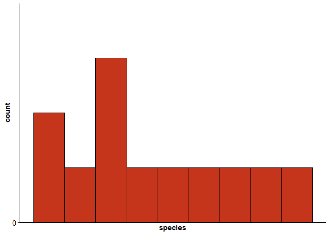
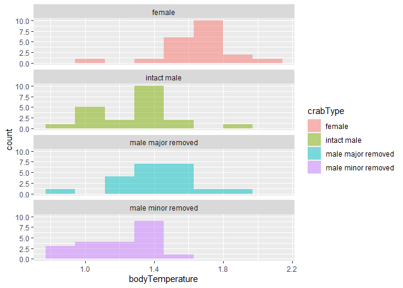
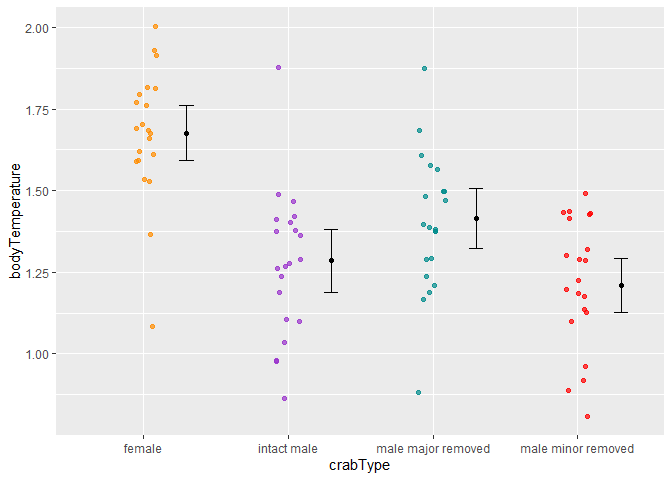

Lab 6 Comparing two means
================
Logan Hillers
04-25-2020

Researchers studying the number of electric fish species living in
various parts of the Amazon basin were interested in whether the
presence of tributaries affected the local number of electric fish
species in the main rivers (Fernandes et al. 2004).

They counted the number of electric fish species above and below the
entrance point of a major tributary at 12 different river locations.

The data is provided in your GitHub repository.

For each question below, write a sentence answering the question and
show the code you used to come up with the answer, if applicable.

## Question A

> Test the hypothesis that the tributaries have no effect on the number
> of species of electric fish.

``` r
# load packages -----------------------------------------------------------

library(tidyverse)
```

    ## -- Attaching packages --------------------------------------- tidyverse 1.3.0 --

    ## v ggplot2 3.3.3     v purrr   0.3.4
    ## v tibble  3.0.4     v dplyr   1.0.2
    ## v tidyr   1.1.2     v stringr 1.4.0
    ## v readr   1.4.0     v forcats 0.5.0

    ## -- Conflicts ------------------------------------------ tidyverse_conflicts() --
    ## x dplyr::filter() masks stats::filter()
    ## x dplyr::lag()    masks stats::lag()

``` r
# read data ---------------------------------------------------------------

fish <- read_csv("chap12q19ElectricFish.csv")
```

    ## 
    ## -- Column specification --------------------------------------------------------
    ## cols(
    ##   tributary = col_character(),
    ##   speciesUpstream = col_double(),
    ##   speciesDownstream = col_double()
    ## )

``` r
# put data in tidy format ------------------------------------------------

fish_long <- 
  pivot_longer(fish, speciesUpstream:speciesDownstream,
               names_to = "location",
               values_to = "species") %>% 
  mutate(location = str_remove(location, c("species"))) %>% 
  print()
```

    ## # A tibble: 24 x 3
    ##    tributary location   species
    ##    <chr>     <chr>        <dbl>
    ##  1 Içá       Upstream        14
    ##  2 Içá       Downstream      19
    ##  3 Jutaí     Upstream        11
    ##  4 Jutaí     Downstream      18
    ##  5 Japurá    Upstream         8
    ##  6 Japurá    Downstream       8
    ##  7 Coari     Upstream         5
    ##  8 Coari     Downstream       7
    ##  9 Purus     Upstream        10
    ## 10 Purus     Downstream      16
    ## # ... with 14 more rows

``` r
# do stuff ----------------------------------------------------------------

fish_ttest <- t.test(species ~ location, data = fish_long)

fish_ttest
```

    ## 
    ##  Welch Two Sample t-test
    ## 
    ## data:  species by location
    ## t = 0.59249, df = 21.81, p-value = 0.5596
    ## alternative hypothesis: true difference in means is not equal to 0
    ## 95 percent confidence interval:
    ##  -4.587031  8.253697
    ## sample estimates:
    ## mean in group Downstream   mean in group Upstream 
    ##                 16.41667                 14.58333

## Question B

> What is the difference in the mean numbers of species between areas
> upstream and downstream of a tributary? What is the 95% confidence
> interval of this difference in means?

Downstream of the tributaries had 1.83334 more species than upstream of
the tributaries (95% CI 4.59-8.25). The difference is not statistically
significant (t = 0.59249, df = 21.81, p = 0.5596).

## Question C

> State the assumptions that you had to make to complete parts (A) and
> (B). Create a graph to assess whether one of those assumptions was
> met.

In order to complete parts (A) and (B) I had to assume that both the
upstream and downstream samples were randomly taken from the population,
that the number of species for both the upstream and downstream groups
was normally distributed, and the standard deviation of the number of
species in both upstream areas and downstream areas has the same
standard deviation. Based on the histogram of the upstream number of
species, it appears that the data does not fit a normal distribution,
meaning that the data violates the assumptions made.

``` r
fish_upstream <- filter(fish_long, location == "Upstream")

ggplot(data = fish_upstream) +
  geom_histogram(mapping = aes(x = species), binwidth = 3,
                 boundary = 0, closed = "left", 
                 fill = "#C5351B", color = "black") +
  labs(x = "species", y = "count") +
  scale_y_continuous(breaks = seq(0, 30, 5), limits = c(0, 4), 
                     expand = expansion(mult = 0)) +
  scale_x_continuous(breaks = seq(0, 600, 100)) +
  theme_classic() +
  theme(
    axis.title = element_text(face = "bold"),
    axis.text = element_text(color = "black", size = rel(1))
  )
```

<!-- -->

## ANOVA

Fiddler crabs are so called because males have a greatly enlarged
“major” claw, which is used to attract females and to defend a
burrow.

Darnell and Munguia (2011) recently suggested that this appendage might
also act as a heat sink, keeping males cooler while out of the burrow on
hot days.

To test this, they placed four groups of crabs into separate plastic
cups and supplied a source of radiant heat (60-watt light bulb) from
above. The four groups were intact male crabs, male crabs with the major
claw removed; male crabs with the other (minor) claw removed (control);
and intact female fiddler crabs.

They measured the body temperature of crabs every 10 minutes for 1.5
hours. These measurements were used to calculate a rate of heat gain for
every individual crab in degrees C/log minute. Rates of heat gain for
all crabs are provided in the accompanying data file.

### Question D

> Graph the distribution of body temperatures for each crab type:

``` r
crab <- read_csv("chap15q27FiddlerCrabFans.csv")
```

    ## 
    ## -- Column specification --------------------------------------------------------
    ## cols(
    ##   crabType = col_character(),
    ##   bodyTemperature = col_double()
    ## )

``` r
crab %>% 
  filter(!is.na(crabType)) %>% 
  ggplot(aes(x = bodyTemperature)) +
  geom_histogram(
    aes(fill = crabType), 
    bins = 8, 
    alpha = 0.5, 
    position = "identity"
  ) +
  facet_wrap( ~ crabType, ncol = 1)
```

<!-- -->

``` r
crab_means <-
  crab %>% 
  filter(!is.na(crabType)) %>%      # remove missing values
  group_by(crabType) %>% 
  summarize(
    mean = mean(bodyTemperature),
    sd = sd(bodyTemperature),
    n = n(),
    sem = sd / sqrt(n),
    upper = mean + 1.96 * sem,
    lower = mean - 1.96 * sem
  ) %>% 
  print()  
```

    ## `summarise()` ungrouping output (override with `.groups` argument)

    ## # A tibble: 4 x 7
    ##   crabType            mean    sd     n    sem upper lower
    ##   <chr>              <dbl> <dbl> <int>  <dbl> <dbl> <dbl>
    ## 1 female              1.68 0.197    21 0.0430  1.76  1.59
    ## 2 intact male         1.29 0.226    21 0.0494  1.38  1.19
    ## 3 male major removed  1.41 0.215    21 0.0469  1.51  1.32
    ## 4 male minor removed  1.21 0.192    21 0.0419  1.29  1.13

``` r
ggplot(data = crab, aes(x = crabType, y = bodyTemperature)) +
  geom_jitter(aes(color = crabType),
              width = 0.1,
              alpha = 0.7,
              show.legend = FALSE,
              na.rm = TRUE) +
  geom_errorbar(aes(y = mean, ymin = lower, ymax = upper), 
                data = crab_means,
                width = .1, position = position_nudge(.3)) +
  geom_point(aes(y = mean), data = crab_means,
             position = position_nudge(.3)) +
  scale_color_manual(values = c("darkorange","darkorchid","cyan4","red"))
```

<!-- -->

### Question E

> Does body temperature vary among crab types? State the null and
> alternative hypothesis, conduct and ANOVA, and interpret the results.

The null hypothesis would be that there is no difference between body
temperatures of the female and male crabs and the alternative hypothesis
is that there is a difference between body temperatures of the female
and male crabs. After conducting the ANOVA test, the p-value is much
lower than 0.05, showing that there is a significant difference between
the body temperature of the female and male crabs, meaning that the null
hypothesis can be rejected. Also, since the f-ratio is 20.31, much
larger than 1, this gives support to the alternative hypothesis.

``` r
aov_crab <-
  aov(bodyTemperature ~ crabType, data = crab)

aov_crab
```

    ## Call:
    ##    aov(formula = bodyTemperature ~ crabType, data = crab)
    ## 
    ## Terms:
    ##                 crabType Residuals
    ## Sum of Squares  2.641310  3.467619
    ## Deg. of Freedom        3        80
    ## 
    ## Residual standard error: 0.2081952
    ## Estimated effects may be unbalanced

``` r
summary(aov_crab)
```

    ##             Df Sum Sq Mean Sq F value Pr(>F)    
    ## crabType     3  2.641  0.8804   20.31  7e-10 ***
    ## Residuals   80  3.468  0.0433                   
    ## ---
    ## Signif. codes:  0 '***' 0.001 '**' 0.01 '*' 0.05 '.' 0.1 ' ' 1
